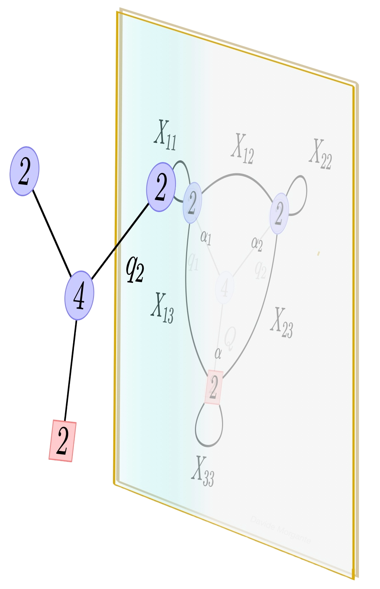
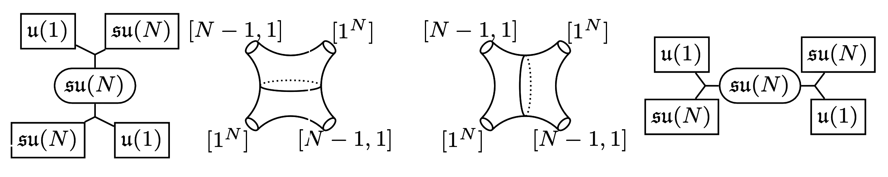
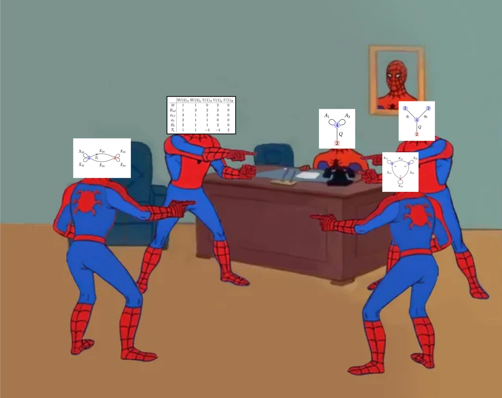

---

title: "Research"
permalink: /research/
author_profile: true
header-includes:
  - \usepackage[mathscr]{euscript}
  - \usepackage{amsmath}
  - \usepackage{physics}
---




Here I would like to give some details of the research I've been pursuing with some buzz-words to the relevant literature and some basics about each topic. 

# Supersymmetric dualities in various dimensions

  

This is the main topic I've worked during my PhD. The basic idea is the following: particles and their interactions are described within the mathematical framework of Quantum Field Theory (QFT). Here it could happen that a given theory breaks down at some energies and, most of the times, we have no means for a non-perturbative description of it in these regimes of energies. When one considers QFTs that are also supersymmetric, meaning that the fermionic and bosonic degrees of freedom of the theory are balanced, could happen that a given theory that breaks down at some energies has an *equivalent description* in terms of another theory which in the same regime of energies is inherently perturbative. This behavior is known as *duality*. Two *gauge* theories $\mathcal{T}_1(G)$ and $\mathcal{T}_2(G^\prime)$ are, roughly, said to be dual whenever 

$$\mathcal{Z}_{\mathcal{T}_1(G)}[\mathscr{M}^d]=\mathcal{Z}_{\mathcal{T}_2(G^\prime)}[\mathscr{M}^d]$$ 

i.e. when their partition function on some $d$-dimensional manifold $\mathscr{M}^d$ agree. Of course this is not the whole story, but is enough to understand the basics.
Dualities are also present in some non-supersymmetric theories like $4d$ Maxwell theory in vacuum. In fact, if one considers $4d$ $\mathrm{U}(1)$ YM whose action is given by 

$$S=-\frac{1}{4g^2}\int\limits_{\mathscr{M}^d}F\wedge \star F$$ 

the equations of motion are just 

$$\mathrm{d}F=0,\qquad\mathrm{d}\star F=0$$ 

which are clearly invariant under the swap $F\leftrightarrow \star F$, which in four dimensions is possible since $F$ is a self-dual two form. This is known as *electro-magnetic duality*. A lot of work has gone into generalizing EM-duality to non-abelian gauge theories. In this context, this duality is known as *S-duality* and plays a fundamental role in String and M-theory, as well as $4d$ supersymmetric theories with $\mathcal{N}\le 4$ supercharges. To this end, I want to give a very interesting fact. Consider $\mathcal{N}=4$ supersymmetric YM in four dimensions with a general gauge group $G$. Its action is approximately given by  

$$S\sim -\int \mathrm{d}^4{x}\frac{\mathrm{i}\tau}{16\pi} W_\alpha W^\alpha$$

where $\tau$ is known as *complexified coupling* and it contains a real part related to the YM coupling $g$ and the imaginary part related to the topological $\theta$-term which is usually discarded in QFT textbooks but is really relevant one discussing *global structures* and *extended operators*. The field $W_\alpha$ is the supersymmetric generalization of the curvature form $F$. The full electromagnetic duality acts on this theory by 

$$ \tau\rightarrow \tau+1,\qquad \tau\rightarrow -\frac{1}{\tau}$$ 

and this action generates a group known as $\mathrm{SL}(2,\mathbb{Z})$, the *modular group of the torus*. This is no coincidence, in fact $\mathcal{N}=4$ SYM can be engineered from M-theory by wrapping a solitonic object known as M5-brane, around a torus $T^2$. EM-duality in M-theory is a pure geometrical concept related to the compact internal manifold $T^2\simeq S^1\times S^1$ and on how one wraps the M5 around the two circles. Not only that, but from String Theory $\mathcal{N}=4$ SYM is engineered by stacking D3-branes on each other and EM-duality is inherited by the $\mathrm{PSL}(2,\mathbb{Z})$ subgroup of $\mathrm{SL}(2,\mathbb{C})$ symmetry of the string worldsheet, acting on the axo-dilaton which sets the coupling of the low energy theory. Of course, the string theory interpretation and the M-theory one are related to each other.

  

Due to this very rich structure, the many  $\mathcal{N}=4$ SYM theories are connected by, what are knonw as, *S-duality orbits*.

## My works on supersymmetric dualities in three-dimensions

  

I have a couple of work in the realm of supersymmetric dualities. Both of these are for theories in three dimensions with $\mathcal{N}=2$ supersymmetry. Both theories have tensor matter, meaning that the particles that makes them are not only in the defining representation of the gauge group, but also, in these cases, in the adjoint. 

My first paper delt with the classification of *chiarl* dualities for theories with gauge groups $\mathrm{U}(N),\mathrm{SU}(N),\mathrm{USp}(2N)$ and two adjoint fields interacting through the polynomial superpotential

$$W=\mathrm{Tr}\,XY^2+\mathrm{Tr}\,X^{n+1}$$

known as $D_n$-type superpotential. We constructed these chiral dualties by *real mass flows* from known non-chiral dualities, meaning that the IR theories were constructed by appropriately integrating out massive fields from the initial theories. These flows can be done in a finite number of ways, and the final theories are classified by two integers $[p,q]$ which are related to the integrating out and the final Chern-Simons term which arise from the mass flow. At each step of this mass flow, the duality is checked by computing the relevant partition function on the squashed $S^3$, being very careful in the arising phase which is related to contact terms in the field theory. These phases are imperative for the equality between the partition functions of the electric and magnetic phase to hold.

Then, I've worked on giving a field theory interpretation to another $3d$ theory with two adjoints. We proved such duality by using basic known dualities, like Ahraony's, after a step known as *deconfinement*. Here a tensor field is exchanged for fundamental matter by adding a supplementary gauge group.

# Higher-form and non-invertible symmetries in String Theory

# M-theory and two-dimensional gauge theories

# Black Hole microstate counting and Surface operators
